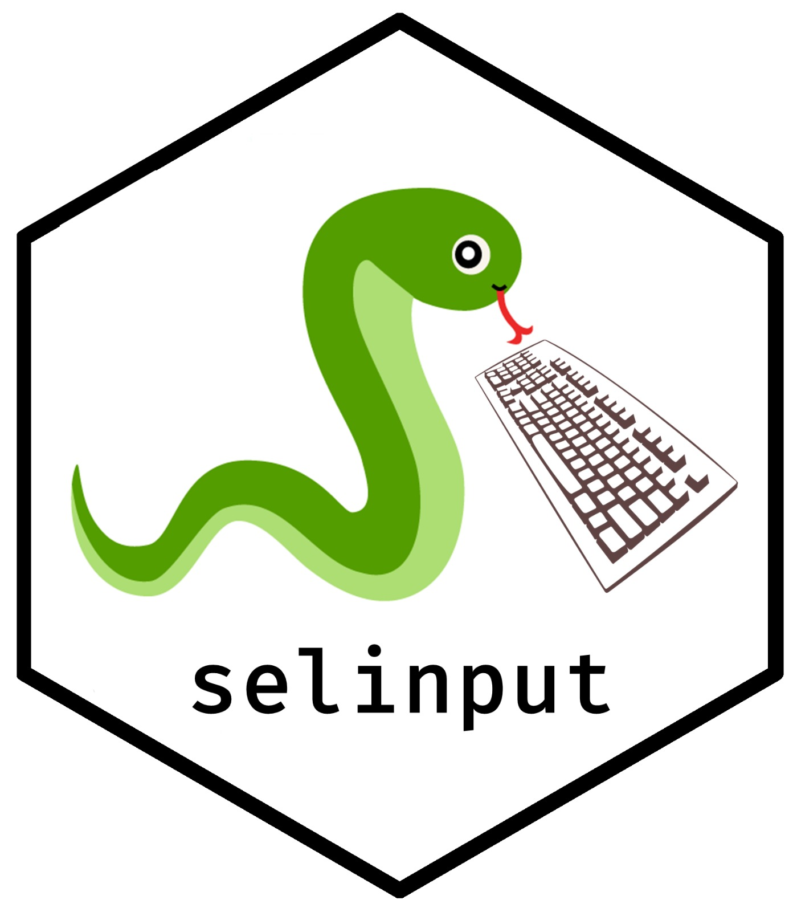

<!-- README.md is generated from README.Rmd. Please edit that file -->

# selinput 

# selinput

<!-- badges: start -->

<!-- badges: end -->

Selinput is a wrapper for the python API pyautogui, which allows to
simulate input from a real mouse and keyboard in a docker container.

## Thanks

A huge thank you to [Favstats](https://github.com/favstats) for
designing each of the hex-stickers.
